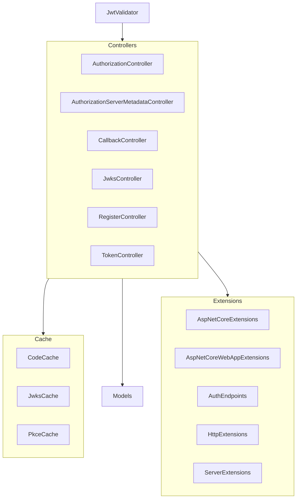

# MCPhappey.Auth

Implements OAuth2/OpenID Connect server endpoints for authentication, integrating with Azure AD and supporting PKCE.

## Architecture

## Key Features
- OAuth2/OpenID Connect endpoints
- Azure AD integration
- PKCE and secure state handling

## Usage

Integrate as a library in your MCP server or Web API host. Provides endpoints for authentication and token management.

## Dependencies
- Microsoft.IdentityModel.Tokens
- System.IdentityModel.Tokens.Jwt
- MCPhappey.Common
