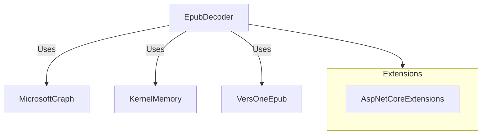

# MCPhappey.Decoders

Provides decoders for various content formats (e.g., EPUB), with integration for AI/memory and Microsoft Graph.

## Architecture

## Key Features
- Decoding of EPUB and other formats
- Integration with Microsoft Graph
- AI/memory content extraction

## Usage

Integrate as a library in your MCP server or Web API host. Use `EpubDecoder` and extension methods for content extraction and decoding.

## Dependencies
- VersOne.Epub
- Microsoft.Graph
- Microsoft.KernelMemory
