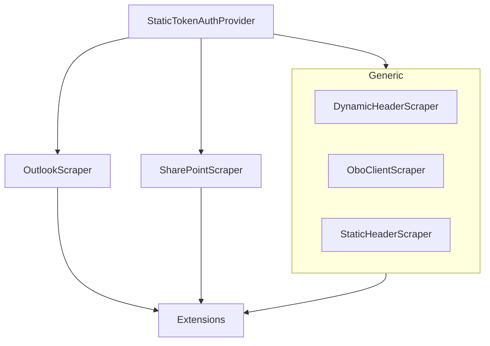

# MCPhappey.Scrapers

Provides a set of scrapers for extracting data from various sources (Generic HTTP, Outlook, SharePoint) with support for dynamic headers and token authentication.

## Architecture

## Key Features
- Generic HTTP scraping with dynamic/static headers and OBO (On-Behalf-Of) support
- Specialized scrapers for Outlook and SharePoint
- Token-based authentication utilities
- Extensible via extension methods

## Usage

Integrate as a library in your MCP server or Web API host. Use the provided scrapers for data extraction from supported sources.

## Dependencies
- MCPhappey.Common
- Microsoft.Graph (for Outlook/SharePoint integration)
