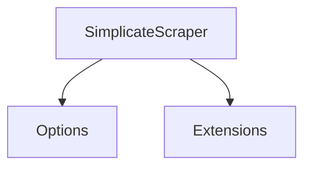

# MCPhappey.Simplicate

Provides a scraper for Simplicate, enabling data extraction and integration with the Simplicate API for MCP servers.

## Architecture

## Key Features
- Data extraction from Simplicate API
- Configurable via options
- Extensible via extension methods

## Usage

Integrate as a library in your MCP server or Web API host. Use `SimplicateScraper` for Simplicate data integration.

## Dependencies
- MCPhappey.Common
- Simplicate API (external)
