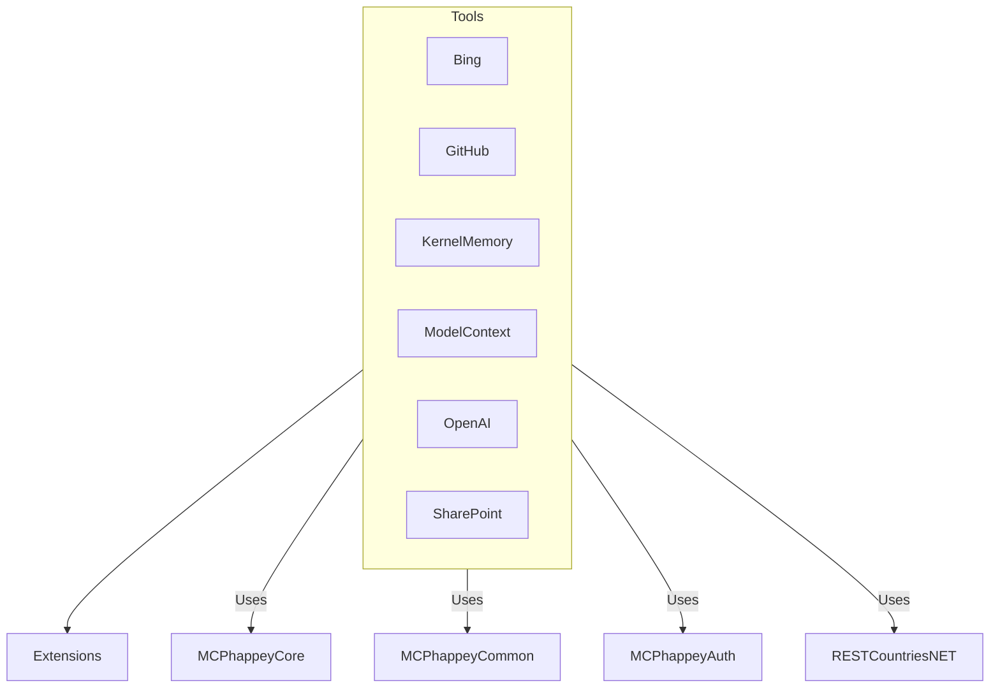

# MCPhappey.Tools

Collection of tool integrations (e.g., Bing, GitHub, OpenAI, SharePoint) for use with MCP servers.

## Architecture

## Key Features
- Integrations for Bing, GitHub, OpenAI, SharePoint, and more
- Extensible toolset for MCP servers
- Used by both static and dynamic server implementations

## Usage

Integrate as a library in your MCP server or Web API host. Provides a set of ready-to-use tool integrations and extension points.

## Dependencies
- MCPhappey.Core
- MCPhappey.Common
- MCPhappey.Auth
- RESTCountries.NET
