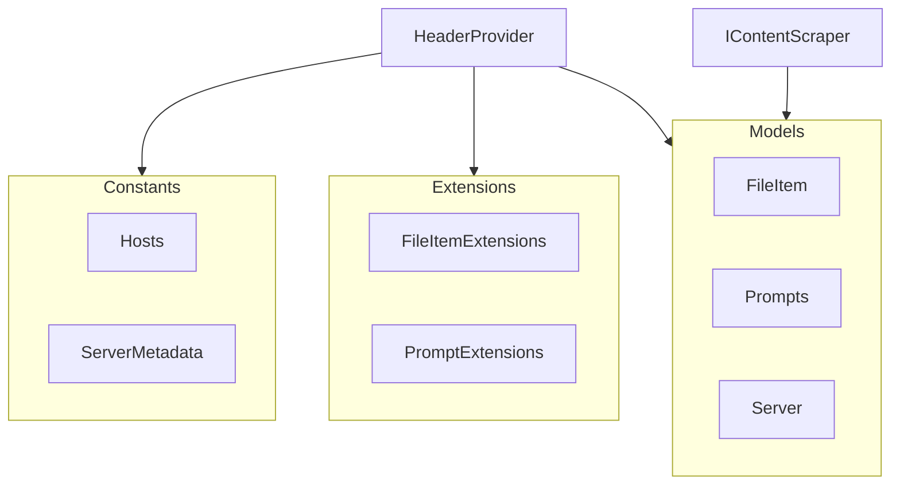

# MCPhappey.Common

Shared models and utilities for MCPhappey projects, built on Model Context Protocol.

## Architecture

## Key Features
- Common data models
- Utility functions and constants
- Used across all MCPhappey packages

## Dependencies
- ModelContextProtocol
- ModelContextProtocol.AspNetCore
