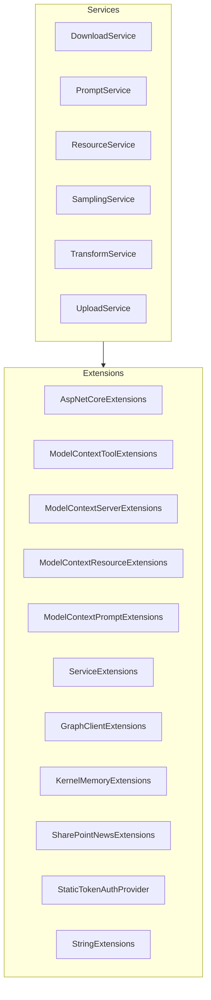

# MCPhappey.Core

Core library implementing dynamic MCP server logic, AI/memory integration, and shared abstractions for the MCPhappey ecosystem.

## Architecture

## Key Features
- Dynamic server hosting and configuration
- Integration with AI (Semantic Kernel, KernelMemory)
- Shared abstractions for all MCPhappey projects

## Dependencies
- MCPhappey.Auth
- MCPhappey.Common
- Microsoft.SemanticKernel
- Microsoft.KernelMemory
- ModelContextProtocol
