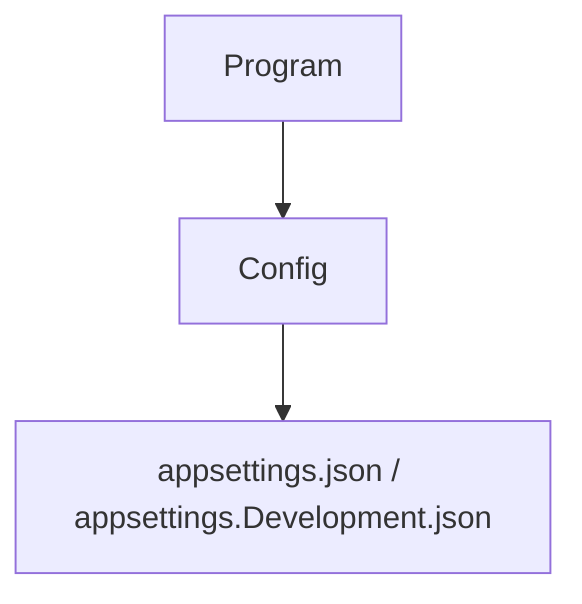

# MCPhappey.WebApi

Web API host for MCPhappey, exposing dynamic MCP servers and tools via HTTP endpoints.

## Architecture



## Key Features
- Hosts and exposes MCP servers over HTTP
- Integrates all MCPhappey packages
- Entry point for web-based access to MCP functionality

## Usage

```sh
dotnet run --project src/MCPhappey.WebApi
```

## Dependencies
- MCPhappey.Core
- MCPhappey.Decoders
- MCPhappey.Servers.SQL
- MCPhappey.Servers.JSON
- MCPhappey.Tools
- MCPhappey.Common
- MCPhappey.Auth
