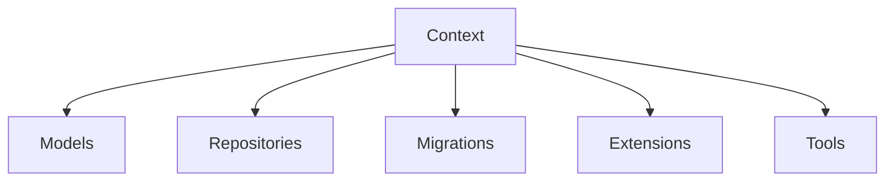

# MCPhappey.Servers.SQL

Implements dynamic MCP servers with configuration and storage backed by SQL Server.

## Architecture

## Key Features
- Dynamic server configuration and management
- SQL Server-backed storage
- Entity Framework Core integration

## Dependencies
- MCPhappey.Core
- MCPhappey.Common
- MCPhappey.Auth
- Microsoft.EntityFrameworkCore
